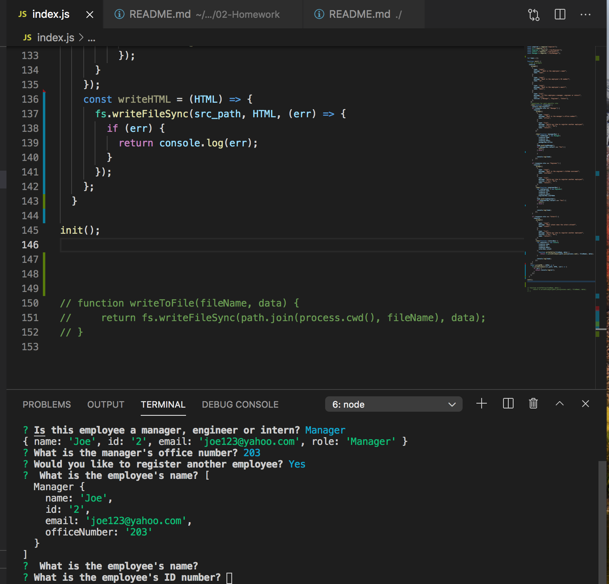

# Team Profile Generator 

[Link to deployable application](https://github.com/Jose8160/TeamProfileGenerator)

# Description

A Node.js command-line application that takes in information about employees on a software engineering team, then generates an HTML webpage that displays summaries for each person. Testing is key to making code maintainable, so you’ll also write a unit test for every part of your code and ensure that it passes each test.

# Table of Contents

- [Installation](#installation)
- [Usage](#usage)
- [Contributed](#contributed)
- [License](#license)
- [Questions](#questions)

# Installation

npm install

# Usage

Answer questions to generate Team Profile

# Contributed

Contributers: Bootcamp Tutor

# License

This application is protected under conditions of the MIT license.

# Questions

My Github Profile: http://www.github.com/Jose8160  
 If there are any questions contact
Jose816orozco@gmail.com
